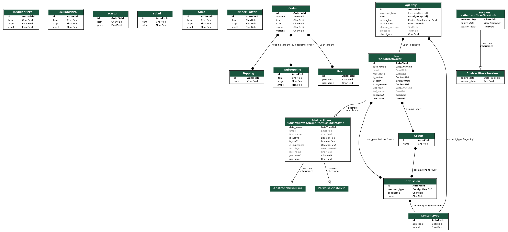

# PINOCCHIO PIZZERIA

This is a web application for handling a pizza restaurant’s online orders. Users will be able to browse the restaurant’s menu, add items to their cart, and submit their orders. Meanwhile, the restaurant owners will be able to add and update menu items and view orders that have been placed.

 ### Milestones
1. **Create Models**: First and the most important step would be to construct a model in such a way that it handles the menu and the various types of possible ordered items. As can be seen from the schema diagram order model has 3 attributes with Many-to-Many fields referring to the user, topping, and sub-topping model. This way we can handle more complex orders with ease. 
 
 

2. **User Authentication**: For registering users and authenticating the users we will take help of django's inbuilt user authentication system. We need add `from .forms import UserRegisterForm` in the views.py. With UserRegistration we are using the default Django user, using username to authenticate. The form will be sent when we render the register.html template. We will use django's  authentication views which will handle login and logout function this would be done by adding following paths to the url.py  
  `path("register/", user_views.register, name='register'),`  
   `path("login/", auth_views.LoginView.as_view(template_name='orders/login.html'), name='login'),`  
   `path("logout/", auth_views.LogoutView.as_view(template_name='orders/logout.html'), name='logout'),`
    
 
  
3. **Adding Item to Cart**: When a user logs in the application will take the user to the home page of the website. On the home page, the user can select items and variant then add it to the cart. From the display of the menu to add the item to the cart all this happens in backend and code for the same can be seen in the views.py. A list of all the items is sent when the home page is rendered. Then the user chooses the item, in the backend post request for the chosen item is sent and in response complete menu for that particular item is sent to the back to the homepage. User is given the freedom to customize the order. After the order is built the user adds the order to the cart.

  
  

4. **Cart**: When the user clicks on the cart button on to the top right of the home page it will take the user to the cart page. All the orders can be seen on the cart page. If the user wants to remove any item he can do so by clicking on the remove button. Finally to place the order the user can click on the "Place order" button. On click, post request is sent and all the orders are added to the Order Model. 
  
  
5. **Personal Touch**: A superuser is created which represents the owner/staff of Pinocchio pizzeria. In the admin page, the owner/staff can view all the orders and confirm orders. Once the owner has confirmed the order is confirmed status in the cart page will be changed from "Pending" to "Confirmed".
 

YouTube video: https://www.youtube.com/watch?v=hk2ywwdmrCU
